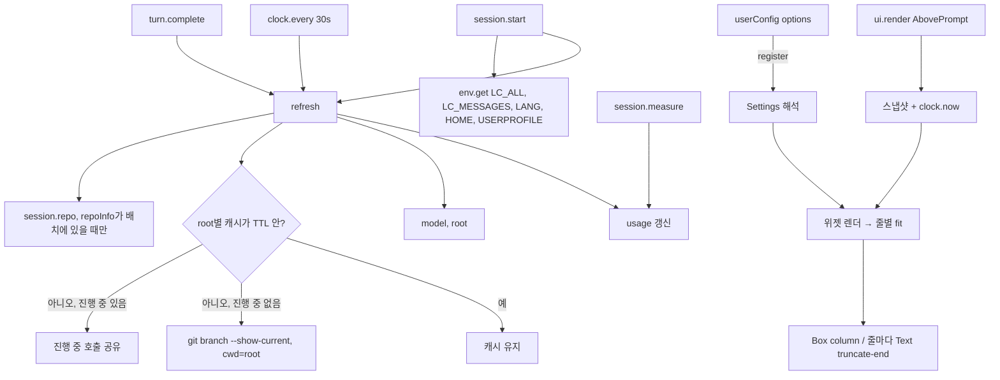

<!-- prowl-workflow: v1 -->
# mod-feature-parity 설계

## 근거
spec.md 전체(§1–§5)를 읽었다.

현재 구현(v0.6.2):
- `src/hooks/register.ts`가 `session.start`·`session.measure`·`turn.complete`·`ui.render{AbovePrompt}` 네 hook으로 동작한다.
- 상태는 모듈 변수(`usage`, `model`, `root`, `branch`, `branchError`)이고, `refreshAll`은 `session.start`와 30초 `$.clock.every` tick에서, `refreshSession`은 `turn.complete`에서 돈다.
- 브랜치는 `$.process.run(['git','branch','--show-current'], { cwd: root, timeoutMs: 2000 })`로 읽고, 실패하면 `branchError`를 band에 흐리게 보인다(주석상 PoC 진단용).
  빈도 제한은 없어 `turn.complete`와 tick마다 git이 돈다.
- 퍼센트 색은 `>= 80` red, `>= 50` yellow로 Go 판(`<= 50` 안전, `<= 80` 경고)과 경계가 다르다.
- band는 `Box({ flexDirection: 'row', marginTop: 1, paddingLeft: 1 })` 한 줄이고 폭 맞춤이 없다.
- `src/.claude-plugin/plugin.json`은 version `0.6.2`, `userConfig` 없음.
  `src/hooks/hooks.json`은 `modules: ["./register.ts"]`.
- `src/.claude-plugin/types/tsconfig.json`의 `include`는 `../../hooks`, `../../types`, `../../tests`다.

mods API(`src/.claude-plugin/types/claude-code/index.d.ts`, Claude Code 2.1.292 생성)에서 확인한 것:
- `Register = (on, options: PluginOptions)`이고 `PluginOptions`는 `Record<string, string | number | boolean | readonly string[]>`이며 manifest 기본값이 채워져 온다.
  옵션이 바뀌면 플러그인이 다시 로드되어 `register`가 새 객체로 다시 불린다.
- `options`를 선언한 string 필드는 `/config`에서 선택지로 그려지고, 선택지 밖 저장값은 미설정으로 보아 기본값이 적용된다.
- `/config` 행 종류 `ConfigKind`는 `boolean`·`choice`·`text`·`number`뿐이라 배열(`multiple`) 행이 없다.
- `session.start`는 플러그인을 새로 로드할 때마다(재로드 포함) 다시 발생한다.
  hot reload는 대기 중인 `$.clock` 타이머를 취소한다.
- `AbovePrompt` props: `hasSurvey`, `isWorking`, `maxRows`, `bodyColumns`(band 트리가 배치되는 칸 수, 엔진의 `[-]` 5칸 제외), `scroll`, `view`.
  "더 넓은 트리는 Text props대로 wrap하거나 truncate한다"고 적혀 있다.
- `Color = ThemeKey | (string & {})`이고 설명은 "theme key, 또는 `"red"` 같은 이름이나 hex"다.
  `TextProps.wrap`은 `'wrap' | 'end' | 'middle' | 'truncate' | 'truncate-start' | 'truncate-middle' | 'truncate-end'`.
- `$.session.root()`는 셸 `cd`로 움직이지 않는다.
  `$.session.repo()`는 "세션이 도는 저장소를 호출마다 working copy에서 읽고, 디렉토리가 저장소 밖이면 null"이며 `SessionRepo.remote`는 `origin` URL(없으면 null), `name`은 엔진 허용 목록에 든 저장소일 때만 값이 있다.
- `$.process.run(argv, { cwd, timeoutMs })`은 셸 없이 실행하고 `{ exitCode, stdout, stderr }`를 준다.
- `$.env.get(name)`의 `name`은 문자열 리터럴이어야 하고 `claude plugin validate`가 읽는 이름을 나열한다.
- `$.clock.now()`·`every`가 있고, 테스트 kit의 `mock.clock`·`mock.env`·`mock.store`가 각 noun을 메모리로 대신한다.
- 테스트 kit(`claude-code/testing`): `test(name, { options }, ($, on) => …)`, `expect`, `mock`, `$.ui.mount({ plugin, surface, component, props })`, 마운트 핸들의 `find`·`findAll`·`drawn`·`redraw`.
  테스트의 `on` hook은 모든 플러그인 아래에 놓이고, 아무도 답하지 않는 `$` 호출은 실패한다.

scratchpad에 복사한 시험 플러그인으로 `claude plugin validate`·`claude plugin test`(2.1.292)를 돌려 확인한 것:
- 테스트에서 `on('process.run', …)`, `on('session.root', …)`, `on('session.repo', …)`이 `{ value }`를 돌려주면 플러그인의 `$` 호출이 그 값을 받고, 호출 횟수를 셀 수 있다.
  `$.session.start({ cwd })`를 부르려면 테스트가 `on('session.start', …)`로 `{ cwd }`를 답해야 한다.
- `register.ts`가 `./lib.ts`의 순수 함수를 import해도 validate가 통과하고, 테스트 파일도 `../hooks/lib.ts`를 import할 수 있다.
- `$`를 다른 파일에서 import한 함수에 넘기면 validate가 "`$` is followed only into a function declared in this same file"로 실패한다.
- `userConfig` number 필드에 `max`를 선언하고 범위 밖 값을 주면 "hooks module did not load"로 모듈이 로드되지 않는다.
  `min`/`max`를 빼면 범위 밖 값(99)이 그대로 `options`로 들어온다.
- 선언 타입과 다른 JSON 값(number 필드에 문자열, string 필드에 숫자)은 `min`/`max`와 무관하게 모듈 로드가 거부된다.
- `options`에 없는 string 값은 "reads as the default"로 기본값이 들어온다.
- `ui.render`에서 `$.clock.now()`·`$.session.repo()`를 부를 수 있다.
- Text 안에 Text를 넣고 바깥 Text에 `wrap: 'truncate-end'`를 둔 트리, `color: '#87d7ff'`, `color: 'ansi256(117)'`이 `terminal`·`desktop` 표 검증을 통과한다.
  kit은 표면의 실제 paint를 다루지 않으므로 터미널에 어떻게 그려지는지는 확인하지 못했다.

Go 판(`origin/deprecated-go`, `1005ee8`)에서 확인한 것:
- `config.go`: `language`(auto/en/ko, 기본 auto), `separator`(pipe/dot/arrow/space), `theme`, `preset`, `lines`, `disabledWidgets`, `widgets.context.barWidth`(0이면 기본 8, 1–40 밖이면 기본값).
  enum이 틀리면 그 항목만 기본값으로 돌린다.
- `render.go`: 테마 8종의 역할(`Model`, `Folder`, `Branch`, `Safe`, `Warning`, `Danger`, `Secondary`, `Accent`, `BarEmpty`, `Dim`)과 값.
  `default`는 256색(`38;5;N`), `minimal`은 기본 ANSI(`37`, `90`, `1;37`), 나머지 6종은 truecolor(`38;2;R;G;B`)다.
  `getColorForPercent`는 `<= 50` Safe, `<= 80` Warning, 그 외 Danger.
  구분자는 pipe `" │ "`, dot `" · "`, arrow `" › "`(기호만 Dim), space `"  "`.
  진행 막대는 `round(percent/100*width)`칸을 퍼센트 색 `█`, 나머지를 BarEmpty 색 `░`로 그린다.
- `widget.go`: `presetCharToWidget`(`M` model, `C` context, `$` cost, `R` rateLimit5h, `7` rateLimit7d, `P` projectInfo, `N` projectName, `G` repoInfo, 버려진 `f` `T` `E` `#`), 줄 구분 `|`, 모르는 문자는 무시, 위젯이 하나도 없는 줄은 버림.
  옛 위젯 문자 `S V a D B H F`는 재사용 금지로 남겨 두었다.
  `detectLanguage`는 `LC_ALL`·`LC_MESSAGES`·`LANG`를 차례로 보며 하나라도 `ko`로 시작하면 `ko`.
  `fitLineWidth`는 오른쪽 위젯부터 하나씩 빼고, 하나 남아도 넘치면 표시폭 기준으로 자르고 `…`를 붙인다.
- `display_width.go`: 한글·CJK·Kana·전각·주요 emoji 범위만 2칸, 제어문자 0칸, 나머지(◆ █ ░ │ › · … 같은 East Asian Ambiguous 포함) 1칸.
- `widgets_core.go`: context는 막대 + 퍼센트(퍼센트 색) + 토큰 수(256K 이상 Warning, 512K 이상 Danger), rate limit은 Secondary 라벨 + 퍼센트 색 값 + Dim `(남은 시간)`, cost는 Accent, model은 Model 색 기호 + ID.
- `widgets_project.go`: `compressHome`(홈이면 `~`, 홈 아래면 `~/…`), `shrinkPath`(50자 넘으면 `<head>/…/<base>`, 그래도 넘으면 base만), `projectName`은 디렉토리 이름 + `(브랜치)`, `repoInfo`는 `owner/name`을 Secondary 색으로.
- `branch_cache.go`: TTL 5초, 프로세스 메모 + 디스크 파일(디스크 부분은 SPEC §4로 제외).
- `locales/{en,ko}.json`: `5h`/`5시간`, `7d`/`7일`, `d h m`/`일 시간 분`.

## 1. 구조
엔진 경계와 순수 계산 계층 둘로 나눈다(§5 "모듈 분리").

엔진 경계(`hooks/register.ts`):
- 모든 `$` 호출, hook 등록, 세션 동안의 상태(사용량, 모델, root, 브랜치 캐시, 저장소 remote, 해석된 언어·홈 경로)를 소유한다.
- `register(on, options)`에서 `options`를 순수 계층의 설정 해석에 넘겨 한 번 얻은 `Settings`를 hook들이 닫아 쓴다.
  옵션이 바뀌면 엔진이 플러그인을 다시 로드하므로 활성화 동안 `Settings`는 바뀌지 않는다.
- 렌더 hook은 순수 계층이 돌려준 줄 목록(`Part` 배열들)을 `$.ui.resolve(e)`의 `Box`·`Text`로 옮기기만 한다.

순수 계산 계층(`hooks/` 아래 별도 파일, `$`·런타임 import 없음, 타입 import만 허용):
- 설정 해석: `PluginOptions` → `Settings`.
  항목마다 따로 검증하고 틀린 항목만 기본값으로 돌린다(SPEC §3, SPEC §5.7).
- 배치 해석: `layout`·`disabledWidgets` 문자열 → 위젯 ID 2차원 목록과 끈 위젯 집합(SPEC §5.2, SPEC §5.3).
- 테마·색: 테마 8종의 역할별 색 표, 퍼센트 색 판정(SPEC §5.4, SPEC §5.8).
- 다국어: en/ko 라벨·시간 단위 표, 로캘 값으로 언어 판정, 남은 시간 포맷(SPEC §5.6).
- 위젯 렌더: 스냅샷 + 설정 → 위젯별 `Part[]` 또는 생략(SPEC §5.1, SPEC §5.7, SPEC §5.10).
- 표시폭·줄 맞춤: 표시폭 계산, 오른쪽부터 빼기, 마지막 자르기(SPEC §5.9).
- 경로·저장소 문자열: 홈 압축, 경로 줄이기, 디렉토리 이름, remote URL → `owner/name`(SPEC §5.10).

이 계층의 각 경계를 한 파일로 둘지 몇 개로 묶을지는 구현이 정하되, `hooks/` 아래에 둔다(release 동기화가 `hooks/`를 통째로 복사한다).

테스트(`src/tests/*.test.ts`):
- 순수 계층 함수 테스트와 `$.ui.mount` 화면 테스트 두 층으로 둔다(§5 "테스트 구조").
- `src/tests/`는 release로 복사되지 않는다.

위젯 목록(ID, preset 문자):

| ID | 문자 | 내용 |
|----|------|------|
| `projectInfo` | `P` | 홈을 `~`로 줄이고 50자로 줄인 root 경로 + `(브랜치)` |
| `projectName` | `N` | root 디렉토리 이름 + `(브랜치)` |
| `repoInfo` | `G` | `origin` remote의 `owner/name`, 없으면 생략 |
| `model` | `M` | 모델 기호 + 모델 ID |
| `context` | `C` | 막대 + 퍼센트 + 토큰 수 |
| `cost` | `$` | `$0.00` |
| `rateLimit5h` | `R` | `5h`/`5시간` + 퍼센트 + 남은 시간 |
| `rateLimit7d` | `7` | `7d`/`7일` + 퍼센트 + 남은 시간 |
| `spendLimit` | `L` | `spend` + 퍼센트 + 남은 시간 |

Go 판의 `f` `T` `E` `#`(버린 위젯)와 옛 금지 문자 `S V a D B H F`는 매핑하지 않아 무시된다(SPEC §4).

## 2. 데이터 흐름

진입과 갱신:
- `register(on, options)`: 설정을 해석해 `Settings`를 만든다.
- `session.start`: 언어 `auto` 판정과 `~` 압축에 쓸 환경변수(`LC_ALL`, `LC_MESSAGES`, `LANG`, `HOME`, `USERPROFILE`)를 리터럴 이름으로 읽어 두고, 전체 갱신을 한 뒤 30초 tick을 건다.
  옵션 변경으로 재로드되면 `session.start`가 다시 오므로 상태와 tick이 새로 선다.
- tick과 `turn.complete`: 사용량(tick만), 모델, root를 다시 읽고 브랜치·저장소 갱신을 시도한 뒤 `ui.render`를 무효화한다.
- `session.measure`: 사용량만 바꾸고 무효화한다.

브랜치 조회(SPEC §5.11, SPEC §5.12):
- 조회 대상 디렉토리는 늘 `$.session.root()`이고 `cwd()`는 쓰지 않는다.
- root별 캐시 항목은 `{ branch, checkedAt, pending }`이고 시각은 `$.clock.now()`로 잰다.
- 갱신 시도 때 `checkedAt`이 TTL(5초) 안이면 git을 실행하지 않고, 실행 중인 호출이 있으면 그 Promise를 함께 기다린다.
- git 실패(비0 종료, 거부, 타임아웃)는 빈 브랜치로 캐시해 TTL 안에서 다시 시도하지 않는다.
- `projectInfo`·`projectName`이 유효 배치에 하나도 없으면 브랜치를 조회하지 않는다.

저장소 조회(SPEC §5.10):
- `repoInfo`가 유효 배치에 있을 때만 브랜치와 같은 갱신 시점·같은 TTL로 `$.session.repo()`를 부른다.
- `remote`가 null이거나 `owner/name`을 뽑을 수 없으면 `repoInfo`를 생략한다.

렌더(`ui.render{AbovePrompt}`):
- `hasSurvey`면 `next(e)`로 비킨다.
- 스냅샷(사용량, 모델, root, 브랜치, remote slug, 홈, 해석된 언어)과 `$.clock.now()`를 순수 계층에 넘긴다.
- `Settings.lines`의 각 줄에서 끈 위젯을 빼고(SPEC §5.3) 위젯별 `Part[]`를 만든다.
  데이터가 없는 위젯(모델 미확인, 해당 rate limit 없음, remote 없음, root 없음)은 생략한다.
- 줄마다 예산 `bodyColumns - 1`(왼쪽 여백 `paddingLeft: 1`)로 맞춘다(SPEC §5.9).
  표시폭이 넘치면 오른쪽 위젯부터 하나씩 빼고, 하나 남아도 넘치면 표시폭 기준으로 `예산-1`칸까지 남기고 `…`를 붙인다.
- 위젯이 남지 않은 줄은 버리고, 줄이 하나도 없으면 `next(e)`를 돌려 band를 그리지 않는다.
- 트리는 `Box({ flexDirection: 'column', marginTop: 1, paddingLeft: 1 })` 아래 줄마다 바깥 `Text({ wrap: 'truncate-end' })` 하나와 그 안의 조각별 `Text`다.
  바깥 Text의 `truncate-end`는 mod의 표시폭 계산이 터미널보다 작게 잰 경우 줄이 다음 행으로 넘어가지 않게 하는 안전망이다.

위젯 렌더 규칙(Go 판 이식):
- 색은 §3 테마 표의 역할을 쓴다(SPEC §5.4).
- `model`: Model 색으로 기호 + ID(기호 표는 v0.6.2와 같다).
- `context`: 막대 칸 수는 `Settings.contextBarWidth`, 채운 칸은 `round(percent/100*width)`를 0..width로 자른 값(SPEC §5.7).
  채운 칸과 퍼센트는 퍼센트 색, 빈 칸은 BarEmpty 색, 토큰 수는 256K 이상 Warning·512K 이상 Danger·그 밖 기본색이다.
  `percent`가 아직 없으면 빈 막대 + Secondary·dim `-`를 그린다.
- `cost`: Accent 색 `$x.xx`.
- rate limit 셋: Secondary 라벨 + `: ` + 퍼센트 색 `floor(percentUsed)%` + dim ` (남은 시간)`.
  spend는 v0.6.2처럼 100을 넘어도 자르지 않는다.
  남은 시간은 `resetsAt - now`로 계산하고 1분 미만·지난 시각이면 생략한다.
- 퍼센트 색은 `<= 50` Safe, `<= 80` Warning, 그 외 Danger(SPEC §5.8).
- `projectInfo`·`projectName`: Folder 색 경로/이름 + Branch 색 ` (브랜치)`, 브랜치가 비면 괄호를 생략한다.
- `repoInfo`: Secondary 색 `owner/name`.
- 구분자: pipe ` │ `, dot ` · `, arrow ` › `는 기호만 dim, space는 공백 두 칸(SPEC §5.5).

실패 경로:
- 설정 항목이 틀리면 그 항목만 기본값이다(SPEC §3).
- `$.process.run`이 거부되거나 비0이면 브랜치 없이 그린다.
- `$.session.repo()`가 거부되면 `repoInfo`를 생략한다.
- 환경변수가 없으면 언어는 `en`, 홈 압축은 하지 않는다.

## 3. 인터페이스

`userConfig` 계약(`src/.claude-plugin/plugin.json`, `/config`에 위에서부터 이 순서로 놓인다):

| 키 | type | 선택지/기본값 | `/config` 행 | 대응 |
|----|------|---------------|--------------|------|
| `layout` | string | 기본 `NMC$R7L` | text | SPEC §5.1, SPEC §5.2 |
| `disabledWidgets` | string | 기본 `""` | text | SPEC §5.3 |
| `theme` | string | `options` 8종, 기본 `default` | choice | SPEC §5.4 |
| `separator` | string | `options` `pipe` `dot` `arrow` `space`, 기본 `pipe` | choice | SPEC §5.5 |
| `language` | string | `options` `auto` `en` `ko`, 기본 `auto` | choice | SPEC §5.6 |
| `contextBarWidth` | number | 기본 `8`, `min`/`max` 선언 안 함 | number | SPEC §5.7 |

- 모든 필드는 `title`·`description`을 갖고 `required`·`sensitive`·`multiple`을 쓰지 않는다.
- `layout`·`disabledWidgets`의 `description`에 문자 표(`P N G M C $ R 7 L`), 위젯 ID, `|`·쉼표 규칙을 적는다.
- `contextBarWidth`의 `description`에 1–40 범위와 범위 밖이면 8이라는 것을 적는다.
- `options` 필드는 Claude Code v2.1.271 이상에서 동작하며, mods 최소 버전 v2.1.287보다 낮으므로 요구 버전을 올리지 않는다(SPEC §3).

`layout` 문법(SPEC §5.2):
- `|`로 줄을 나눈다.
- 한 줄은 쉼표나 공백으로 토큰을 나눈다.
- 토큰이 위젯 ID와 정확히 같으면 그 위젯이고, 아니면 토큰의 각 문자를 preset 문자로 읽는다.
  모르는 문자는 버린다.
- 위젯이 하나도 없는 줄은 버리고, 남은 줄이 없으면 기본 배치를 쓴다.
- 예: `PMC$|R7L`, `projectInfo, model | rateLimit5h rateLimit7d`, `N model C`.

`disabledWidgets` 문법(SPEC §5.3):
- `layout`의 토큰 규칙을 그대로 쓰되 줄 구분 없이 하나의 집합으로 읽는다.

순수 계층의 경계 타입과 함수(이름은 제안이며 의미가 계약이다):
- `type WidgetId = 'projectInfo' | 'projectName' | 'repoInfo' | 'model' | 'context' | 'cost' | 'rateLimit5h' | 'rateLimit7d' | 'spendLimit'`
- `type Settings = { theme: ThemeName; separator: SeparatorName; language: 'auto' | 'en' | 'ko'; contextBarWidth: number; lines: WidgetId[][]; disabled: ReadonlySet<WidgetId> }`
- `resolveSettings(options: PluginOptions): Settings` — 각 키를 타입·값으로 검증하고 틀린 항목만 기본값으로 둔다.
  `contextBarWidth`는 1–40 정수가 아니면 8이다.
- `parseWidgetTokens(text: string): WidgetId[][]`
- `type Part = { text: string; color?: string; dimColor?: boolean; bold?: boolean }`
- `type Snapshot = { usage: Figures | null; model: string; root: string; branch: string; repoSlug: string | null; homes: string[]; language: 'en' | 'ko'; now: number }`
- `renderWidget(id: WidgetId, s: Snapshot, settings: Settings): Part[] | null` — null은 생략.
- `buildLines(s: Snapshot, settings: Settings, budget: number): Part[][]` — 끄기·렌더·구분자·줄 맞춤까지 마친 줄 목록.
- `displayWidth(text: string): number`, `fitLine(widgets: Part[][], separator: Part[], budget: number): Part[]`
- `detectLanguage(values: (string | undefined)[]): 'en' | 'ko'` — `LC_ALL`, `LC_MESSAGES`, `LANG` 순으로 하나라도 `ko`로 시작하면 `ko`.
- `formatTimeRemaining(ms: number, lang: 'en' | 'ko'): string` — 빈 문자열이면 생략.
- `compressHome(path: string, homes: string[]): string`, `shrinkPath(path: string, max: number): string`, `baseName(path: string): string`
  `/`와 `\`를 모두 구분자로 보고, 홈 비교는 구분자를 맞춘 뒤 드라이브 문자가 있는 경로면 대소문자를 무시한다.
- `parseRemoteSlug(url: string): string | null` — `https://host/owner/name(.git)`, `git@host:owner/name(.git)`, `ssh://…/owner/name(.git)`에서 마지막 두 경로 조각을 뽑는다.

테마 표(SPEC §5.4):
- 역할은 `model`, `folder`, `branch`, `safe`, `warning`, `danger`, `secondary`, `accent`, `barEmpty`이고 각 값은 `{ color: string; bold?: boolean }`이다.
  Go의 `Info`(worktree 표시)와 `BarFilled`(Go 코드에서 쓰지 않음)는 옮기지 않는다.
- truecolor 테마 6종(`catppuccin`, `dracula`, `gruvbox`, `nord`, `tokyoNight`, `solarized`)은 `render.go`의 `R;G;B`를 `#rrggbb`로 그대로 옮긴다.
- `default`(256색)는 xterm 256색 표로 hex로 바꾼다.

| 역할 | Go 코드 | hex |
|------|---------|-----|
| model | 117 | `#87d7ff` |
| folder, warning, accent | 222 | `#ffd787` |
| branch | 218 | `#ffafd7` |
| safe | 151 | `#afd7af` |
| danger | 210 | `#ff8787` |
| secondary | 249 | `#b2b2b2` |
| barEmpty | 240 | `#585858` |

- `minimal`(기본 ANSI)은 `37` → `white`, `90` → `gray`, `1;37` → `white` + `bold`로 옮긴다.
- Go의 `Dim`은 `dimColor: true`로 옮긴다.

엔진 경계 안의 계약:
- 브랜치 캐시: `Map<root, { branch: string; checkedAt: number; pending?: Promise<void> }>`, TTL 5000ms, 시각은 `$.clock.now()`.
- 브랜치 명령은 `['git', 'branch', '--show-current']`, `cwd: root`, `timeoutMs: 2000`(v0.6.2와 같음, detached HEAD는 빈 문자열).
- `$`를 받는 함수(`refresh`, `readBranch`, `readRepo` 등)는 모두 `register.ts` 최상위에 선언한다(CLAUDE.md §hooks module 규칙).

## 4. 영향 범위
- `src/hooks/register.ts`: 고정 세그먼트 조립(`buildSegments` 이하)을 순수 계층 호출로 바꾸고, `options`를 받으며, 브랜치 캐시·환경변수 읽기·`repo()` 조회를 더한다.
  `branchError`를 band에 그리던 PoC 진단 표시는 없앤다(§5 "브랜치 실패 표시").
- `src/hooks/` 아래 순수 계층 파일이 새로 생긴다.
  `src/hooks/hooks.json`의 `modules`는 `./register.ts` 하나로 그대로다.
- `src/.claude-plugin/plugin.json`: `userConfig`를 더하고 `version`을 `0.6.2`에서 올린다(SPEC §3, SPEC §5.14).
- `src/tests/`가 새로 생긴다(SPEC §5.15).
  `src/.claude-plugin/types/tsconfig.json`이 이미 `../../tests`를 포함하므로 `tsc -p src --noEmit`이 테스트까지 검사한다(SPEC §5.13).
- `release` 브랜치: 프로젝트 `CLAUDE.md` §배포 절차대로 `hooks/` 전체와 `plugin.json`을 복사한다.
  절차가 `hooks/`를 통째로 복사하므로 새 순수 계층 파일도 함께 간다(SPEC §5.14).
- 프로젝트 `CLAUDE.md` §구조의 파일 나열이 실제와 맞도록 새 파일과 `tests/`를 더한다(인접 범위).
- 사용자가 관찰하는 기본 화면 변화: 항목·순서는 v0.6.2와 같고(SPEC §5.1), 퍼센트 색 경계가 Go 기준으로 바뀌며(SPEC §5.8), 기본 테마 색과 로캘에 따른 라벨이 바뀐다(사용자 승인 완료).
- 기존 `cc-usage.json`은 읽지 않으므로 마이그레이션은 없다(SPEC §4).

## 5. Decision Points
**줄별 배치·끄기 목록을 `userConfig`로 표현하는 방식(SPEC §5.2, SPEC §5.3)**
- `multiple` string 배열(`lines`를 줄마다 한 문자열, `disabledWidgets`를 ID 배열): JSON 구조가 Go 판과 가장 가깝다. `/config`에 배열 행이 없어(`ConfigKind`에 배열 없음) SPEC §2의 "`settings.json`을 손으로 고치지 않는다"를 지키지 못한다.
- 고정 개수 text 필드(`line1`, `line2`, `line3`)와 위젯별 boolean 끄기 토글 9개: `/config`에서 줄과 끄기를 각각 행으로 편집한다. 줄 수에 상한이 생기고 행이 14개 안팎으로 늘며, 토글 9개는 `layout`에서 빼는 것과 기능이 겹친다.
- text 필드 하나 `layout`(`|`로 줄 구분, preset 문자·ID 혼용)과 text 필드 하나 `disabledWidgets`: 한 행에서 줄 수 제한 없이 편집하고 Go `preset` 표기를 그대로 받으며, 두 필드가 같은 토큰 규칙을 공유한다. 사용자가 문법을 알아야 하므로 `description`에 표기를 적어야 한다.
- 채택: text 필드 `layout`과 `disabledWidgets`. `/config`에서 편집 가능해야 한다는 목표와 SPEC §5.2의 두 표기를 한 행으로 모두 만족하는 유일한 안이다.

**`contextBarWidth` 범위 검증 위치(SPEC §3, SPEC §5.7)**
- manifest에 `min: 1`, `max: 40` 선언: `/config` 입력 단계에서 범위를 알려 준다. 시험에서 범위 밖 저장값이 모듈 로드 실패로 이어져 band 전체가 사라졌으므로 SPEC §3과 SPEC §5.7("범위 밖이면 기본 폭 8")을 어긴다.
- 선언하지 않고 mod가 검증: 범위 밖 값이 mod까지 와서 그 항목만 8로 돌아간다. `/config`가 범위를 강제하지 않아 `description`으로만 알린다.
- 채택: 선언하지 않고 mod가 검증. SPEC §5.7의 동작을 그대로 만족하는 쪽이다.

**선언 타입과 다른 JSON 값(위험)**
- 엔진은 `options`를 모듈 로드 전에 선언 타입으로 검증하고, 타입이 다르면 모듈을 로드하지 않는다(시험에서 number·string 양쪽 확인).
  `/config`의 number·text·choice 행으로는 이런 값을 넣을 수 없고, `settings.json`을 손으로 고칠 때만 생긴다.
- 모든 필드를 string으로 선언: number 행이 text 행이 될 뿐 string 필드에 숫자를 넣으면 똑같이 로드가 거부되므로 위험이 줄지 않는다.
- 현재 선언 타입 유지: `/config` 경로는 안전하고, 손 편집 타입 오류만 엔진이 거부한다.
- 채택: 현재 선언 타입 유지. mod 코드가 이 경로에 개입할 수 없으므로 SPEC §3에 예외로 명시했다.

**테마 색을 Text `color`로 옮기는 방식(SPEC §5.4)**
- theme key(`success`·`warning`·`error` 등): 사용자의 Claude Code 테마를 따른다. 8종 테마를 구분할 수 없어 SPEC §5.4를 만족하지 못한다.
- `ansi256(N)` 문자열: Go의 256색 코드를 그대로 쓴다. types는 이름과 hex만 언급하고 "모르는 값을 어떻게 그릴지는 표면 몫"이라 해 터미널·desktop에서 그려진다는 보장이 없다(시험은 표 검증만 통과).
- hex(`#rrggbb`)와 기본 색 이름: types가 명시한 형태라 두 표면 모두 받는다. 256색 코드를 hex로 바꿔야 하고, truecolor를 못 쓰는 터미널에서는 표면이 근사색으로 줄인다(추정).
- 채택: hex와 기본 색 이름(`white`, `gray`). types가 보장하는 형태만 쓴다.

**표시폭 계산과 band 폭 맞춤(SPEC §5.9)**
- Text의 `wrap`(`truncate-end`)에만 맡김: 구현이 가장 작다. 줄 끝을 자를 뿐 "오른쪽 위젯부터 통째로 빼기"를 하지 못해 SPEC §5.9를 만족하지 못한다.
- mod가 표시폭을 직접 계산(`display_width.go` 표 이식)해 위젯 단위로 빼고 마지막에 자름: SPEC §5.9의 순서와 "한글·CJK 2칸"을 그대로 재현하고 순수 함수로 테스트된다. 터미널이 Ambiguous 문자(◆ █ │ 등)를 2칸으로 그리면 mod 계산보다 넓어진다.
- 직접 계산 + 줄마다 바깥 Text `truncate-end` 안전망: 앞 안의 동작에 더해 계산이 빗나가도 줄이 다음 행으로 넘어가지 않는다. 중첩 Text의 실제 paint는 kit이 다루지 않아 확인하지 못했다(추정).
- 채택: 직접 계산 + 안전망. 예산은 `bodyColumns - 1`(v0.6.1의 왼쪽 여백 1칸 유지)이다.

**git 실행 빈도 제한과 root 기준(SPEC §5.11, SPEC §5.12)**
- 30초 tick에만 의존(현재): tick 사이에는 git이 돌지 않는다. `turn.complete`와 `session.start`가 tick과 따로 git을 돌려 간격 보장이 없다.
- root별 메모리 캐시 + TTL 5초 + 진행 중 호출 공유: 어떤 경로로 갱신이 와도 같은 root에서 5초 안에 git은 한 번이며, `$.clock.now()`를 쓰므로 `mock.clock`으로 시험된다. 브랜치 전환은 다음 갱신 시점(턴 끝 또는 30초 tick)에야 보인다.
- TTL을 tick과 같은 30초로: git 실행이 더 줄어든다. `git checkout` 뒤 턴이 끝나도 최대 30초간 옛 브랜치가 남는다.
- 채택: root별 캐시 + TTL 5초(Go `branchCacheTTL`과 같음) + 진행 중 공유. 조회 디렉토리는 늘 `$.session.root()`라 셸 `cd`가 이름·경로·브랜치를 바꾸지 않는다. 디스크 캐시는 SPEC §4로 두지 않는다.

**`repoInfo`의 remote 출처(SPEC §5.10, SPEC §5.12)**
- `git config --get remote.origin.url`을 root에서 실행: root 기준이 확실하다. 갱신 한 번에 git이 두 번 돌아 SPEC §5.12의 "일정 간격 안에 한 번"과 부딪힌다.
- `$.session.repo()`의 `remote`를 파싱: SPEC §1 입력 맥락이 든 API이고 mod가 git을 더 실행하지 않는다. types의 "세션이 도는 저장소"가 `cwd()`의 "세션이 도는 디렉토리"와 같은 표현이라 셸 `cd`를 따라갈 가능성이 있다(추정). `SessionRepo.name`은 엔진 허용 목록 저장소에서만 값이 있어 `remote` URL을 직접 파싱해야 한다.
- 채택: `$.session.repo()`. SPEC §5.11은 이름·경로·브랜치만 고정하므로 범위 안이며, `repoInfo`가 배치에 있을 때만 브랜치와 같은 TTL로 부른다. 엔진이 내부에서 git을 실행하는지는 확인하지 못했다(추정).

**모듈 분리(SPEC §3, SPEC §5.13, SPEC §5.15)**
- 단일 `register.ts`: validate 규칙을 가장 단순하게 지킨다. 순수 로직을 테스트하려면 화면 마운트를 거쳐야 하고 파일이 커진다.
- `register.ts`(엔진 경계) + `hooks/` 아래 순수 계층 파일: 순수 함수를 테스트가 직접 import하고(시험 확인), validate도 통과한다(시험 확인). `$`를 순수 계층에 넘기면 validate가 실패하므로 경계를 지켜야 한다.
- 채택: 엔진 경계 + 순수 계층. `$`를 받는 함수는 `register.ts` 최상위에만 둔다.

**테스트 구조(SPEC §5.15)**
- 화면 테스트만: 사용자가 보는 결과를 그대로 본다. 표시폭·파싱 경계값마다 마운트와 stub이 필요해 테스트가 무겁다.
- 순수 함수 테스트 + `$.ui.mount` 화면 테스트: 경계값은 순수 테스트가, 설정이 band까지 이어지는지는 화면 테스트가 본다.
- 채택: 두 층. 분담은 다음과 같다.
  - 순수: `layout` 문법과 끄기(SPEC §5.2, SPEC §5.3), 테마 8종 역할 색(SPEC §5.4), 구분자 4종(SPEC §5.5), 언어 판정과 시간 포맷(SPEC §5.6), 막대 폭과 범위 밖 8(SPEC §5.7), 퍼센트 경계 50/51/80/81(SPEC §5.8), 표시폭·빼기·자르기(SPEC §5.9).
  - 화면: `test({ options })`로 설정을 주고, `on('session.start')`·`on('session.usage')`·`on('session.model')`·`on('session.root')`·`on('session.repo')`·`on('process.run')`을 `{ value }`로 답하고, `mock.env`·`mock.clock`을 건 뒤 `$.session.start`와 `$.ui.mount({ surface: 'terminal', component: 'AbovePrompt', props })`로 그려 `find`/`findAll`로 본다(SPEC §5.1–SPEC §5.9).
  - 같은 하네스로 `process.run` 호출 수와 `cwd`를 세어 SPEC §5.10–SPEC §5.12도 본다.
  - 위 stub 방식은 시험 플러그인에서 동작을 확인했다.

**spend 위젯의 preset 문자·ID(SPEC §5.1, SPEC §5.2)**
- `S`: 기억하기 쉽다. Go 판이 옛 위젯 문자로 재사용을 금지한 집합에 들어 있어, 옛 preset 문자열을 옮겨 적은 사용자에게 다른 위젯이 나타난다.
- `%`: 비어 있다. 비용 `$`와 모양이 비슷해 어떤 위젯인지 떠올리기 어렵다.
- `L`(Limit)과 ID `spendLimit`: 점유 문자(`M C $ R 7 P N G`, 버린 `f T E #`)와 금지 집합(`S V a D B H F`) 어디와도 겹치지 않고, ID는 엔진의 `spend_limit` kind와 Go의 camelCase ID 관례를 따른다.
- 채택: `L`과 `spendLimit`. 기본 `layout`은 `NMC$R7L`로 v0.6.2의 항목·순서와 같다(SPEC §5.1).

**기본값(SPEC §5.1, SPEC §5.4, SPEC §5.6)**
- v0.6.2 색(cyan·magenta·blue·yellow)을 별도 기본 테마로, 언어 기본 `en`: 업데이트해도 화면이 거의 그대로다. SPEC §5.4의 8종 밖 테마가 하나 더 생기고 Go 판과 기본이 달라진다.
- Go 판 기본(`theme` `default`, `language` `auto`, `separator` `pipe`, 막대 8): Go 판 사용자가 알던 기본을 되찾고 SPEC §5.4의 목록과 정확히 맞는다. 설정을 안 바꾼 사용자도 색이 바뀌고 한국어 로캘에서는 라벨이 한국어가 된다.
- 채택: Go 판 기본. SPEC §1·§2가 Go 판 능력 복원을 목표로 하며, 관찰 결과가 바뀌는 점은 사용자가 승인했다.

**브랜치 실패 표시(SPEC §5.10)**
- v0.6.2의 `(git: <오류>)` 흐린 표시 유지: git 실패 원인이 band에 보인다. SPEC §5.10이 정한 `projectName`·`projectInfo` 내용(이름·경로와 브랜치) 밖의 문자열이고 표시폭을 차지하며, 코드 주석상 PoC 진단용이다.
- 실패하면 브랜치 괄호만 생략(Go 판 동작): SPEC §5.10의 내용과 맞는다. 실패 원인이 화면에서 사라진다.
- 채택: 괄호 생략. 원인 확인이 필요하면 `$.ui.log(…, { to: 'debug' })` 같은 화면 밖 기록을 쓰는 것은 구현이 정한다.
